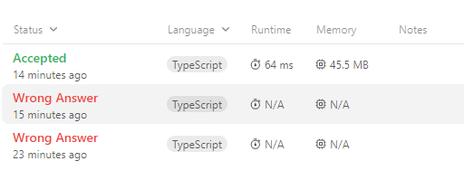

# 8. string to Integer-atoi

[LeetCode - The World's Leading Online Programming Learning Platform](https://leetcode.com/problems/string-to-integer-atoi/submissions/)

<br/>

**Problem:**

주어진 단계 별 처리 조건을 따라 String을 Integer로 변환 하는 문제


<br/>

**Constraints:**

- '0 <= s.length <= 200'
- 's' consists of English letters (lower-case and upper-case), digits (0-9), ' ', '+', '-', and '.'.


**Example:**

```
Input: s = "   -42"
Output: -42
Explanation:
Step 1: "   -42" (leading whitespace is read and ignored)
            ^
Step 2: "   -42" ('-' is read, so the result should be negative)
             ^
Step 3: "   -42" ("42" is read in)
               ^
The parsed integer is -42.
Since -42 is in the range [-231, 231 - 1], the final result is -42.
```

###  **풀이**

---

```tsx
1
Read in and ignore any leading whitespace.

2
Check if the next character (if not already at the end of the string) is '-' or '+'. 
Read this character in if it is either. 
This determines if the final result is negative or positive respectively. Assume the result is positive if neither is present.

3
Read in next the characters until the next non-digit character or 
the end of the input is reached. The rest of the string is ignored.

4
Convert these digits into an integer (i.e. "123" -> 123, "0032" -> 32). 
If no digits were read, then the integer is 0. Change the sign as necessary (from step 2).

5
If the integer is out of the 32-bit signed integer range [-231, 231 - 1], then clamp the integer so that it remains in the range. 
Specifically, integers less than -231 should be clamped to -231, and integers greater than 231 - 1 should be clamped to 231 - 1.
Return the integer as the final result.
```

javascript의 입장에서는, 자주 사용되는 내장 메소드만 잘 알고 있으면 해결이 쉬운 편 이라고 생각한다. + 영어 해석 ㅠ

1. 양 끝의 공백 제거
2. 마지막 글자가 아니라면, 첫 문자열이 ‘-’ 인지 ‘+’ 인지 확인, 그게 최종 숫자의 부호가 된다. 둘 다 없으면 기본 값은 양수 
3. 중간에 숫자가 아닌 값이 나오면 거기까지만 숫자로 취급한다. 이후는 제거
4. 문자열을 숫자로 바꿔라 (타입 변환)
5. 만약 정수로 표현할 수 있는 최대 또는 최소 범위일 경우 넘는 경계 값을 반환해라


**1차 실패**

첫 글자가 부호가 없는 경우에는 처음부터 숫자인 부분을 놓침

- 시작 인덱스 변수를 추가하여 , 첫 글자가 + , - 인지 체크하여, 있을 경우에 확인하는 시작 인덱스를 1 없을 경우에는 0으로 하여 수정

**2차 실패**

테스트 케이스 " +0 123” 에서 중간 공백에 걸림

공백을 숫자로 판단하여 숫자 변환 전 공백을 추가해 버려서 Number변환에서 NaN 처리 당했다.

```tsx
console.log(Number('0 123')) // NaN
```

- 숫자인지 확인하는 조건 앞에 문자열이 공백일 경우도 체크함

3차 성공



- 해결 코드
    
    ```tsx
    function myAtoi(s: string): number {
      // #1
      // Read in and ignore any leading whitespace.
      let ret = s.trim();
    
      // #2
      // Check if the next character (if not already at the end of the string) is '-' or '+'.
      // Read this character in if it is either.
      // This determines if the final result is negative or positive respectively.
      // Assume the result is positive if neither is present.
      let plus = true;
      let startIdx = 0;
      if (ret.length > 1) {
        if (ret[0] === "-") {
          plus = false;
          startIdx = 1;
        }
        if (ret[0] === "+") {
          startIdx = 1;
        }
      }
    
      // #3
      // Read in next the characters until the next non-digit character or the end of the input is reached.
      // The rest of the string is ignored.
      let tmpString = "";
      for (let i = startIdx; i < ret.length; i++) {
        if (ret[i] === "" || isNaN(Number(ret[i]))) break;
        tmpString = tmpString.concat(ret[i]);
      }
    
      // #4
      // Convert these digits into an integer (i.e. "123" -> 123, "0032" -> 32).
      // If no digits were read, then the integer is 0. Change the sign as necessary (from step 2).
      let ans = Number(tmpString);
      if (plus === false) ans = ans *= -1;
    
      // #5
      // If the integer is out of the 32-bit signed integer range [-2^31, 2^31 - 1],
      // then clamp the integer so that it remains in the range.
      // Specifically, integers less than -2^31 should be clamped to -2^31, and integers greater than 2^31 - 1 should be clamped to 2^31 - 1.
      if (ans > Math.pow(2, 31) - 1) return Math.pow(2, 31) - 1;
      if (ans < -1 * Math.pow(2, 31)) return Math.pow(2, 31) * -1;
    
      return ans;
    }
    ```
    

### **Check Point**

---

- String.trim() 의 경우, 앞뒤 공백을 제거한다.
- Number(’ ‘) 공백을 바꿀 경우 0 이 나온다. 그래서 Typescript에서 isNaN(Number(value)) 를 통해 숫자 인지 판단을 할 경우에, value에 ‘ ‘ 공백이 들어올 경우 숫자로 판단 해버린다. 주의 할 것
- JS에서 Number.MAX_SAFE_INTEGER 의 값은 2^32-1 이 아닌 2^53-1 이다.
- Math.pow 사용 시 순서대로 쓰면 된다.